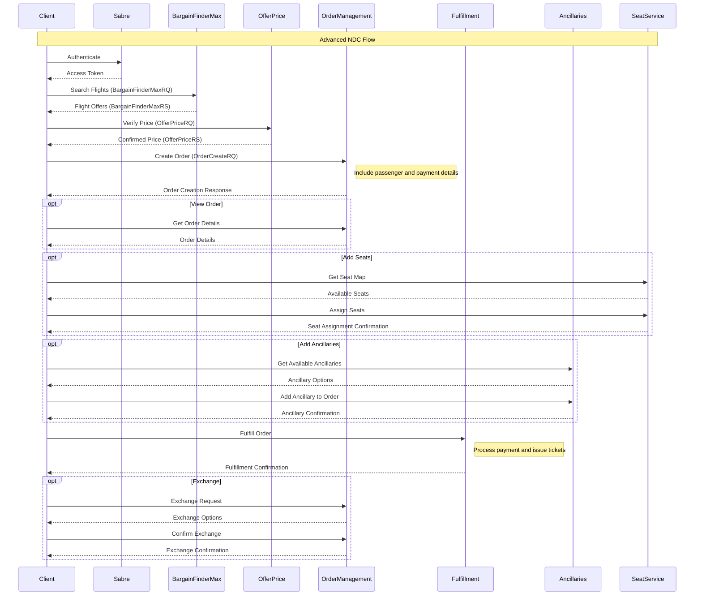

# Sabre API Wrapper for Laravel

A robust Laravel wrapper for Sabre APIs supporting both REST and SOAP endpoints with comprehensive authentication handling.

A comprehensive Laravel wrapper for Sabre NDC APIs supporting both basic and advanced NDC flows.

## Features

- Support for both REST and SOAP APIs
- Automatic token management with refresh and rotation
- Session pool for SOAP APIs with automatic cleanup
- Configurable rate limiting and retry strategies
- Comprehensive error handling
- Support for all major Sabre API services
- Health monitoring and metrics
- Distributed locking mechanism
- Caching strategies with configurable TTLs
- Full NDC (New Distribution Capability) support

## Requirements

- PHP 8.1 or higher
- Laravel 8.0 or higher
- PHP SOAP extension installed and enabled
- Valid Sabre API credentials with appropriate access levels
- Composer for package management
- SSL support enabled

## Installation

```bash
composer require santosdave/sabre-wrapper
```

The service provider will automatically register itself in Laravel 8+. For earlier versions, add the provider manually:

```php
// config/app.php
'providers' => [
    // ...
    Santosdave\SabreWrapper\SabreServiceProvider::class,
],

'aliases' => [
    // ...
    'Sabre' => Santosdave\SabreWrapper\Facades\Sabre::class,
]
```

## Configuration

1. Publish the config file:

```bash
php artisan vendor:publish --provider="Santosdave\SabreWrapper\SabreServiceProvider"
```

2. Add the following environment variables to your `.env` file:

```env
# Required Sabre Credentials
SABRE_USERNAME=
SABRE_PASSWORD=
SABRE_PCC=
SABRE_CLIENT_ID=
SABRE_CLIENT_SECRET=

# Environment (cert or prod)
SABRE_ENVIRONMENT=cert

# Authentication Settings
SABRE_AUTH_VERSION=3
SABRE_AUTH_METHOD=rest

# Token Lifetimes (in seconds)
SABRE_REST_TOKEN_LIFETIME=604800
SABRE_SOAP_SESSION_LIFETIME=900
SABRE_SOAP_STATELESS_LIFETIME=604800

# Refresh Thresholds (in seconds)
SABRE_REST_REFRESH_THRESHOLD=300
SABRE_SOAP_SESSION_REFRESH_THRESHOLD=60
SABRE_SOAP_STATELESS_REFRESH_THRESHOLD=3600

# Session Pool Settings
SABRE_SESSION_POOL_ENABLED=true
SABRE_SESSION_POOL_SIZE=5
SABRE_SESSION_POOL_CLEANUP_INTERVAL=900
SABRE_SESSION_POOL_LOCK_TIMEOUT=10


# Request Settings
SABRE_REQUEST_TIMEOUT=30
SABRE_REQUEST_RETRIES=3
SABRE_REQUEST_RETRY_DELAY=1000
SABRE_VERIFY_SSL=true

# Authentication Retry Settings
SABRE_AUTH_RETRY_MAX_ATTEMPTS=3
SABRE_AUTH_RETRY_DELAY_MS=1000
SABRE_AUTH_RETRY_MULTIPLIER=2

# Caching Settings
SABRE_CACHE_ENABLED=true
SABRE_CACHE_TTL=3600
SABRE_CACHE_PREFIX=sabre:

# Logging Settings
SABRE_LOGGING_ENABLED=true
SABRE_LOG_CHANNEL=sabre
SABRE_LOG_LEVEL=debug

# Monitoring
SABRE_HEALTH_CHECK_INTERVAL=60
SABRE_HEALTH_NOTIFICATION_THRESHOLD=3

# Queue Settings
SABRE_DEFAULT_QUEUE=100
SABRE_DEFAULT_QUEUE_CATEGORY=0
SABRE_QUEUE_AUTO_REMOVE=true
SABRE_QUEUE_POLLING_ENABLED=false
SABRE_QUEUE_POLLING_INTERVAL=300
SABRE_QUEUE_POLLING_MAX_ITEMS=50
SABRE_QUEUE_RETRY_ATTEMPTS=3
SABRE_QUEUE_RETRY_DELAY=5
```

3. Configuration File Details (config/sabre.php):

```php
return [
    /*
    |--------------------------------------------------------------------------
    | Sabre API Environment
    |--------------------------------------------------------------------------
    |
    | This value determines which Sabre API environment to use.
    | Supported: "cert", "prod"
    */
    'environment' => env('SABRE_ENVIRONMENT', 'cert'),

    /*
    |--------------------------------------------------------------------------
    | API Endpoints
    |--------------------------------------------------------------------------
    */
    'endpoints' => [
        'cert' => [
            'rest' => 'https://api.cert.platform.sabre.com',
            'soap' => 'https://webservices.cert.platform.sabre.com'
        ],
        'prod' => [
            'rest' => 'https://api.platform.sabre.com',
            'soap' => 'https://webservices.platform.sabre.com'
        ]
    ],

    /*
    |--------------------------------------------------------------------------
    | API Credentials
    |--------------------------------------------------------------------------
    */
    'credentials' => [
        'username' => env('SABRE_USERNAME'),
        'password' => env('SABRE_PASSWORD'),
        'pcc' => env('SABRE_PCC'),
        'client_id' => env('SABRE_CLIENT_ID'),
        'client_secret' => env('SABRE_CLIENT_SECRET')
    ],

    // ... Full configuration details
];
```

## Basic Usage

### Air Shopping

```php
use Santosdave\SabreWrapper\Facades\Sabre;

// Create shopping request
$request = new BargainFinderMaxRequest();
$request->addOriginDestination(
    'JFK',
    'LHR',
    '2024-03-15'
);

// Execute search
$results = Sabre::shopping()->bargainFinderMax($request);

// Access results
foreach ($results->getOffers() as $offer) {
    echo $offer['total_fare']['amount'];
}
```

### Order Management

```php
// Create order
$request = new OrderCreateRequest();
$request->setOffer($offerId, [$offerItemId])
    ->addPassenger(
        'PAX1',
        'John',
        'Doe',
        '1990-01-01',
        'ADT',
        'CONTACT1'
    );

$order = Sabre::order()->createOrder($request);

// Fulfill order
$fulfillRequest = new OrderFulfillRequest($order->getOrderId());
$fulfillRequest->setPaymentCard(
    $cardNumber,
    $expirationDate,
    $vendorCode,
    $cvv,
    $contactInfoRefId
);

$result = Sabre::order()->fulfillOrder($fulfillRequest);
```

## Service Types

The wrapper supports both REST and SOAP services. You can specify the type when creating a service:

```php
// REST Service (default)
$restShopping = Sabre::shopping();

// SOAP Service
$soapShopping = Sabre::shopping(ServiceFactory::SOAP);

```

## Advanced Features

### Health Monitoring

```php
// Get service health status
$health = Sabre::health()->checkStatus();

// Get detailed metrics
$metrics = Sabre::health()->getMetrics();
```

### Rate Limiting

```php
// Check current rate limit status
$status = Sabre::getRateLimitStatus();

// Handle rate limit exceeded
try {
    $results = Sabre::shopping()->bargainFinderMax($request);
} catch (SabreRateLimitException $e) {
    $retryAfter = $e->getRetryAfter();
    $resetTime = $e->getReset();
}
```

### Caching

```php
// Enable caching for specific requests
$results = Cache::remember('flight_search_' . md5(serialize($params)), 300, function () use ($request) {
    return Sabre::shopping()->bargainFinderMax($request);
});
```

## Basic NDC Flow

The basic NDC flow consists of the following steps:

1. Shopping (BargainFinderMax)
2. Price Verification
3. Create Booking
4. Get/View Booking
5. Cancel Booking (if needed)

### Example Implementation:

```php
use Santosdave\SabreWrapper\Facades\Sabre;

// 1. Shop for Offers
$shopRequest = new BargainFinderMaxRequest();
$shopRequest
    ->addOriginDestination(
        'JFK',
        'LHR',
        '2024-03-15'
    )
    ->setTravelPreferences([
        'vendorPrefs' => ['AA', 'BA'],
        'cabinPrefs' => ['Y']
    ])
    ->addTraveler('ADT', 1);

$shopResponse = Sabre::shopping()->bargainFinderMax($shopRequest);

// 2. Price Verification
$priceRequest = new OfferPriceRequest();
$priceRequest
    ->addOfferItem($shopResponse->getOffers()[0]['offerId'])
    ->setCreditCard(
        'MC',
        '545251',
        'FDA'
    );

$priceResponse = Sabre::pricing()->priceOffer($priceRequest);

// 3. Create Booking
$bookingRequest = new CreateBookingRequest();
$bookingRequest
    ->setFlightOffer(
        $priceResponse->getOfferId(),
        [$priceResponse->getOfferItemId()]
    )
    ->addTraveler(
        'PAXID1',
        'John',
        'Doe',
        '1990-01-01',
        'ADT'
    )
    ->setContactInfo(
        ['john@example.com'],
        ['1234567890']
    );

$booking = Sabre::booking()->createBooking($bookingRequest);

// 4. Get Booking Details
$bookingDetails = Sabre::booking()->getBooking($booking->getConfirmationId());

// 5. Cancel if needed
$cancelled = Sabre::booking()->cancelBooking(
    $booking->getConfirmationId(),
    true, // retrieveBooking
    true  // cancelAll
);
```

## Advanced NDC Flow

The advanced NDC flow provides more control and features:

1. Shopping (BargainFinderMax)
2. Price Verification
3. Order Creation
4. Order Management (View/Change)
5. Fulfillment
6. Exchange (if needed)

### Example Implementation:

```php
// 1. Create Order with Advanced Options
$orderRequest = new OrderCreateRequest();
$orderRequest
    ->setOffer($priceResponse->getOfferId(), [$priceResponse->getOfferItemId()])
    ->addPassenger(
        'PAX1',
        'ADT',
        'John',
        'Doe',
        '1990-01-01'
    )
    ->addContactInfo(
        'CI-1',
        ['john@example.com'],
        ['1234567890']
    );

$orderResponse = Sabre::order()->createOrder($orderRequest);

// 2. Order Fulfillment with Payment
$fulfillRequest = new OrderFulfillRequest($orderResponse->getOrderId());
$fulfillRequest
    ->setPaymentCard(
        $cardNumber,
        $expirationDate,
        $vendorCode,
        $cvv,
        'CI-1'
    )
    ->setAmount(161.60, 'USD');

$fulfillResponse = Sabre::order()->fulfillOrder($fulfillRequest);

// 3. Add Ancillary Services
$ancillaryRequest = new AncillaryRequest();
$ancillaryRequest
    ->setTravelAgencyParty($pseudoCityId, $agencyId)
    ->addFlightSegment(
        'SEG1',
        'JFK',
        'LHR',
        '2024-03-15',
        'AA',
        '100',
        'Y'
    );

$ancillaries = Sabre::ancillary()->getAncillaries($ancillaryRequest);

// 4. Seat Assignment
$seatRequest = new SeatAssignRequest($orderResponse->getOrderId());
$seatRequest
    ->addSeatAssignment('PAX1', 'SEG1', '12A')
    ->setPaymentCard(
        $cardNumber,
        $expirationDate,
        $cardCode,
        $cardType,
        50.00,
        'USD'
    );

$seatResponse = Sabre::seat()->assignSeats($seatRequest);

// 5. Order Management
// View Order
$viewRequest = new OrderViewRequest($orderResponse->getOrderId());
$orderDetails = Sabre::order()->viewOrder($viewRequest);

// Change Order
$changeRequest = new OrderChangeRequest($orderResponse->getOrderId());
$changeRequest->addModifyPassengerAction('PAX1', [
    'contactInfo' => ['email' => 'newemail@example.com']
]);
$changeResponse = Sabre::order()->changeOrder($changeRequest);

// Split Order
$splitRequest = new OrderSplitRequest($orderResponse->getOrderId());
$splitRequest->addSplitItem('ITEM1', ['PAX1']);
$splitResponse = Sabre::order()->splitOrder($splitRequest);

// Exchange Order
$exchangeRequest = new OrderExchangeRequest($orderResponse->getOrderId());
$exchangeRequest
    ->addExchangeItem('ITEM1')
    ->setNewItinerary($newFlightDetails)
    ->setPaymentCard(
        $cardNumber,
        $expirationDate,
        $vendorCode,
        $cvv,
        'CI-1'
    );

$exchangeResponse = Sabre::order()->exchangeOrder($exchangeRequest);
```

## Key Differences Between Basic and Advanced NDC Flows

1. **Booking vs Orders**

   - Basic Flow: Uses CreateBooking for simple reservation
   - Advanced Flow: Uses OrderCreate with more features

2. **Payment Processing**

   - Basic Flow: Payment handled outside the API
   - Advanced Flow: Integrated payment processing

3. **Ancillary Services**

   - Basic Flow: Limited ancillary support
   - Advanced Flow: Full ancillary service support

4. **Changes and Modifications**
   - Basic Flow: Simple cancellation
   - Advanced Flow: Complex changes, exchanges

## Service Components

- Shopping Service
- Pricing Service
- Booking Service
- Order Management Service
- Ancillary Service
- Seat Service
- Exchange Service
- Fulfillment Service

## Error Handling

```php
try {
    $response = Sabre::booking()->createBooking($request);
} catch (SabreAuthenticationException $e) {
    // Handle authentication errors
    Log::error('Authentication failed', [
        'error' => $e->getMessage(),
        'code' => $e->getCode()
    ]);
} catch (SabreRateLimitException $e) {
    // Handle rate limiting
    Log::warning('Rate limit exceeded', [
        'retry_after' => $e->getRetryAfter()
    ]);
} catch (SabreApiException $e) {
    // Handle general API errors
    Log::error('API error', [
        'message' => $e->getMessage(),
        'details' => $e->getErrorDetails()
    ]);
}
```

## Flow Diagram



## Logging

All API calls are automatically logged if logging is enabled. Logs include:

- Request details
- Response status
- Error information
- Authentication events
- Token refresh events

## Testing

Run the test suite:

```bash
composer test
```

## License

This package is open-sourced software licensed under the MIT license.

## Support

For issues and feature requests, please use the [GitHub issue tracker](https://github.com/santosdave/sabre-wrapper/issues).

## Contributing

Please see [CONTRIBUTING.md](CONTRIBUTING.md) for details.

## Security

If you discover any security related issues, please email your security contact instead of using the issue tracker.
