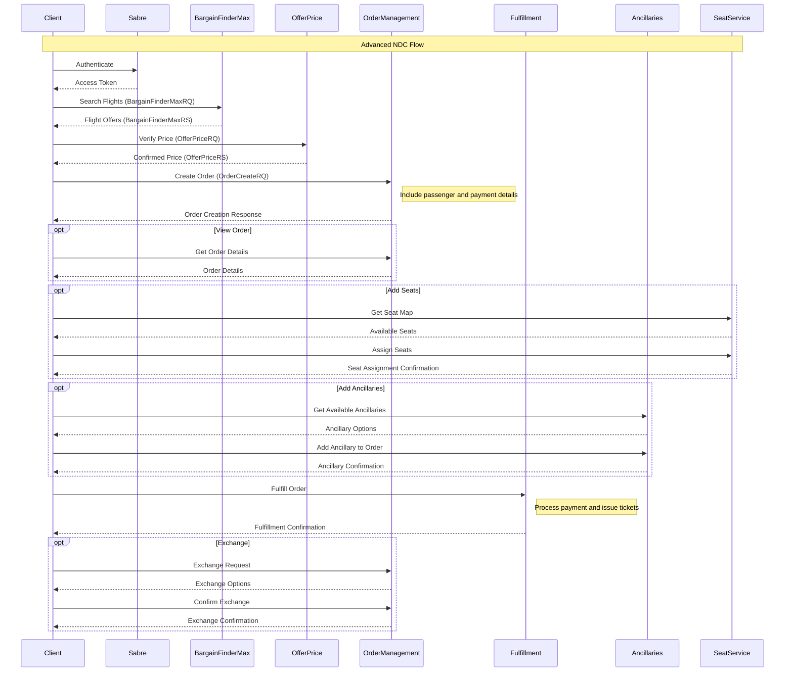

# Sabre API Wrapper for Laravel

A robust Laravel wrapper for Sabre APIs supporting both REST and SOAP endpoints with comprehensive authentication handling.

A comprehensive Laravel wrapper for Sabre NDC APIs supporting both basic and advanced NDC flows.

## Features

- Support for both REST and SOAP APIs
- Automatic token management and refresh
- Session pool for SOAP APIs
- Configurable retry strategies
- Comprehensive error handling
- Support for all major Sabre API services

## Installation

```bash
composer require santosdave/sabre-wrapper
```

The service provider will automatically register itself.

## Configuration

1. Publish the config file:

```bash
php artisan vendor:publish --provider="Santosdave\SabreWrapper\SabreServiceProvider"
```

2. Add the following environment variables to your `.env` file:

```env
# Required Sabre Credentials
SABRE_USERNAME=
SABRE_PASSWORD=
SABRE_PCC=
SABRE_CLIENT_ID=
SABRE_CLIENT_SECRET=

# Environment (cert or prod)
SABRE_ENVIRONMENT=cert

# Authentication Settings
SABRE_AUTH_VERSION=3
SABRE_AUTH_METHOD=rest

# Token Lifetimes (in seconds)
SABRE_REST_TOKEN_LIFETIME=604800
SABRE_SOAP_SESSION_LIFETIME=900
SABRE_SOAP_STATELESS_LIFETIME=604800

# Refresh Thresholds (in seconds)
SABRE_REST_REFRESH_THRESHOLD=300
SABRE_SOAP_SESSION_REFRESH_THRESHOLD=60
SABRE_SOAP_STATELESS_REFRESH_THRESHOLD=3600

# Session Pool Settings
SABRE_SESSION_POOL_ENABLED=true
SABRE_SESSION_POOL_SIZE=5
SABRE_SESSION_POOL_CLEANUP_INTERVAL=900
SABRE_SESSION_POOL_LOCK_TIMEOUT=10

# Request Settings
SABRE_REQUEST_TIMEOUT=30
SABRE_REQUEST_RETRIES=3
SABRE_REQUEST_RETRY_DELAY=1000
SABRE_VERIFY_SSL=true

# Authentication Retry Settings
SABRE_AUTH_RETRY_MAX_ATTEMPTS=3
SABRE_AUTH_RETRY_DELAY_MS=1000
SABRE_AUTH_RETRY_MULTIPLIER=2

# Caching Settings
SABRE_CACHE_ENABLED=true
SABRE_CACHE_TTL=3600
SABRE_CACHE_PREFIX=sabre:

# Logging Settings
SABRE_LOGGING_ENABLED=true
SABRE_LOG_CHANNEL=sabre
SABRE_LOG_LEVEL=debug

# Queue Settings
SABRE_DEFAULT_QUEUE=100
SABRE_DEFAULT_QUEUE_CATEGORY=0
SABRE_QUEUE_AUTO_REMOVE=true
SABRE_QUEUE_POLLING_ENABLED=false
SABRE_QUEUE_POLLING_INTERVAL=300
SABRE_QUEUE_POLLING_MAX_ITEMS=50
SABRE_QUEUE_RETRY_ATTEMPTS=3
SABRE_QUEUE_RETRY_DELAY=5
```

3. Configuration File Details (config/sabre.php):

```php
return [
    /*
    |--------------------------------------------------------------------------
    | Sabre API Environment
    |--------------------------------------------------------------------------
    |
    | This value determines which Sabre API environment to use.
    | Supported: "cert", "prod"
    */
    'environment' => env('SABRE_ENVIRONMENT', 'cert'),

    /*
    |--------------------------------------------------------------------------
    | API Endpoints
    |--------------------------------------------------------------------------
    */
    'endpoints' => [
        'cert' => [
            'rest' => 'https://api.cert.platform.sabre.com',
            'soap' => 'https://webservices.cert.platform.sabre.com'
        ],
        'prod' => [
            'rest' => 'https://api.platform.sabre.com',
            'soap' => 'https://webservices.platform.sabre.com'
        ]
    ],

    /*
    |--------------------------------------------------------------------------
    | API Credentials
    |--------------------------------------------------------------------------
    */
    'credentials' => [
        'username' => env('SABRE_USERNAME'),
        'password' => env('SABRE_PASSWORD'),
        'pcc' => env('SABRE_PCC'),
        'client_id' => env('SABRE_CLIENT_ID'),
        'client_secret' => env('SABRE_CLIENT_SECRET')
    ],

    // ... Full configuration details
];
```

## Basic Usage

```php
use Santosdave\SabreWrapper\Facades\Sabre;

// Air Shopping
$results = Sabre::shopping()->bargainFinderMax($request);

// Air Booking
$booking = Sabre::booking()->createPnr($request);

// Availability Check
$availability = Sabre::availability()->getAvailability($request);

// Queue Management
$queueList = Sabre::utility()->listQueue($request);
```

## Service Types

The wrapper supports both REST and SOAP services. You can specify the type when creating a service:

```php
// REST Service (default)
$restShopping = Sabre::shopping();

// SOAP Service
$soapShopping = Sabre::shopping(ServiceFactory::SOAP);

```

## Basic NDC Flow

The basic NDC flow consists of the following steps:

1. Shopping (BargainFinderMax)
2. Price Verification
3. Create Booking
4. Get/View Booking
5. Cancel Booking (if needed)

### Example Implementation:

```php
use Santosdave\SabreWrapper\Facades\Sabre;

class FlightBookingController
{
    public function searchFlights(Request $request)
    {
        // 1. Shopping with BargainFinderMax
        $shopRequest = new BargainFinderMaxRequest();
        $shopRequest->addOriginDestination(
            $request->origin,
            $request->destination,
            $request->departureDate
        );
        $shopRequest->addTraveler('ADT', 1); // 1 adult

        $shopResponse = Sabre::shopping()->bargainFinderMax($shopRequest);

        // Get selected offer from response
        $selectedOffer = $shopResponse->getOffers()[0];

        // 2. Price Verification
        $priceRequest = new OfferPriceRequest();
        $priceRequest->setOfferItem($selectedOffer['offerId']);

        $priceResponse = Sabre::pricing()->priceOffer($priceRequest);

        // 3. Create Booking
        $bookingRequest = new CreateBookingRequest();
        $bookingRequest->setFlightOffer(
            $priceResponse->getOfferId(),
            [$priceResponse->getOfferItemId()]
        );

        // Add passenger details
        $bookingRequest->addTraveler(
            'PAXID1',
            'John',
            'Doe',
            '1990-01-01',
            'ADT'
        );

        // Add contact info
        $bookingRequest->setContactInfo(
            ['john@example.com'],
            ['1234567890']
        );

        $bookingResponse = Sabre::booking()->createBooking($bookingRequest);

        // Get confirmation ID
        $confirmationId = $bookingResponse->getConfirmationId();

        // 4. View Booking
        $viewResponse = Sabre::booking()->getBooking($confirmationId);

        return $viewResponse->getData();
    }
}
```

## Advanced NDC Flow

The advanced NDC flow provides more control and features:

1. Shopping (BargainFinderMax)
2. Price Verification
3. Order Creation
4. Order Management (View/Change)
5. Fulfillment
6. Exchange (if needed)

### Example Implementation:

```php
use Santosdave\SabreWrapper\Facades\Sabre;

class FlightOrderController
{
    public function createOrder(Request $request)
    {
        // 1. Shopping with BargainFinderMax
        $shopRequest = new BargainFinderMaxRequest();
        $shopRequest->addOriginDestination(
            $request->origin,
            $request->destination,
            $request->departureDate
        );
        $shopRequest->setTravelPreferences([
            'preferredCarriers' => ['AA', 'BA'],
            'cabinPreferences' => ['Y']
        ]);

        $shopResponse = Sabre::shopping()->bargainFinderMax($shopRequest);

        // 2. Price Verification
        $priceRequest = new OfferPriceRequest();
        $priceRequest->setOfferItem($shopResponse->getOffers()[0]['offerId']);
        $priceRequest->setCreditCard(
            'MC',
            '545251',
            'FDA'
        );

        $priceResponse = Sabre::pricing()->priceOffer($priceRequest);

        // 3. Create Order
        $orderRequest = new OrderCreateRequest();
        $orderRequest->setOffer(
            $priceResponse->getOfferId(),
            [$priceResponse->getOfferItemId()]
        );

        // Add passenger
        $orderRequest->addPassenger(
            'PAXID1',
            'John',
            'Doe',
            '1990-01-01',
            'ADT',
            'john@example.com'
        );

        // Add contact info
        $orderRequest->addContactInfo(
            'CI-1',
            ['john@example.com'],
            ['1234567890']
        );

        $orderResponse = Sabre::order()->createOrder($orderRequest);

        // 4. Fulfill Order with Payment
        $fulfillRequest = new OrderFulfillRequest($orderResponse->getOrderId());
        $fulfillRequest->setCreditCardPayment(
            '4111111111111111',
            '2025-12',
            '123',
            'VI',
            1000.00,
            'USD',
            'CI-1'
        );

        $fulfillResponse = Sabre::order()->fulfillOrder($fulfillRequest);

        return $fulfillResponse->getData();
    }

    // Add seats to order
    public function addSeats(string $orderId)
    {
        // Get seat map
        $seatRequest = new SeatMapRequest();
        $seatRequest->setOrderId($orderId);

        $seatMap = Sabre::seats()->getSeatMap($seatRequest);

        // Assign seats
        $assignRequest = new SeatAssignRequest($orderId);
        $assignRequest->addSeatAssignment(
            'PAXID1',
            'SEG1',
            '12A'
        );

        return Sabre::seats()->assignSeats($assignRequest);
    }
}
```

## Key Differences Between Basic and Advanced NDC Flows

1. **Booking vs Orders**

   - Basic Flow: Uses CreateBooking for simple reservation
   - Advanced Flow: Uses OrderCreate with more features

2. **Payment Processing**

   - Basic Flow: Payment handled outside the API
   - Advanced Flow: Integrated payment processing

3. **Ancillary Services**

   - Basic Flow: Limited ancillary support
   - Advanced Flow: Full ancillary service support

4. **Changes and Modifications**
   - Basic Flow: Simple cancellation
   - Advanced Flow: Complex changes, exchanges

## Service Components

- Shopping Service
- Pricing Service
- Booking Service
- Order Management Service
- Ancillary Service
- Seat Service
- Exchange Service
- Fulfillment Service

## Error Handling

The wrapper provides specific exception classes for different types of errors:

```php
use Santosdave\SabreWrapper\Exceptions\SabreApiException;
use Santosdave\SabreWrapper\Exceptions\SabreAuthenticationException;
use Santosdave\SabreWrapper\Exceptions\SabreAuthorizationException;
use Santosdave\SabreWrapper\Exceptions\SabreRateLimitException;

try {
    $results = Sabre::shopping()->bargainFinderMax($request);
} catch (SabreRateLimitException $e) {
    // Handle rate limiting
    $retryAfter = $e->getRetryAfter();
} catch (SabreAuthenticationException $e) {
    // Handle authentication failures
} catch (SabreAuthorizationException $e) {
    // Handle authorization failures
} catch (SabreApiException $e) {
    // Handle other API errors
}
```

## Flow Diagram



## Logging

All API calls are automatically logged if logging is enabled. Logs include:

- Request details
- Response status
- Error information
- Authentication events
- Token refresh events

## Testing

Run the test suite:

```bash
composer test
```

## License

This package is open-sourced software licensed under the MIT license.

## Support

For issues and feature requests, please use the [GitHub issue tracker](https://github.com/santosdave/sabre-wrapper/issues).

## Contributing

Please see [CONTRIBUTING.md](CONTRIBUTING.md) for details.

## Security

If you discover any security related issues, please email your security contact instead of using the issue tracker.
